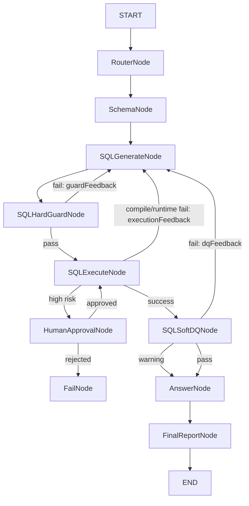

# ChatBI 主链路开发设计

## 1. 目标

本文档定义 DataAgent 项目下一阶段的核心建设目标：优先完成企业级 ChatBI / Text2SQL 主链路。

当前项目已经具备 Spring Boot 平台层、Python Agent Engine、Run Trace、SQL Gateway、RAG/CrossValidation 占位链路和评测骨架。后续不再优先扩展 RAG、评论归因、重排模型和复杂多层防御，而是先把 ChatBI 主链路做实。

目标能力：

```text
用户自然语言问题
  -> Schema 裁剪
  -> LLM 生成 SQL
  -> SQL 硬拦截
  -> SQL 安全执行
  -> DQ 软拦截
  -> 自动修正
  -> 结构化回答和图表
  -> 全链路 Run Trace / Audit / Eval
```

核心原则：

1. Agent Engine 不直接连接数据库。
2. SQL 生成在 Python，SQL 治理和执行在 Java。
3. 硬拦截必须在执行前发生。
4. SQL Gateway 内部必须二次强制校验，防止绕过 Agent Engine。
5. DQ 软拦截负责判断结果是否能回答问题，不承担安全兜底。
6. 每一次失败都必须转化为结构化 feedback，回流给 SQLGenerateNode。
7. 所有节点必须写入 Run Trace，所有 SQL 必须写入审计。

## 2. 分层架构

项目按四层划分：

| 层级 | 职责 | 主要归属 |
|---|---|---|
| 引擎层 | Agent 编排、状态机、分支、重试、checkpoint、Human-in-the-loop | Python LangGraph |
| 工具层 | Schema、Metric、SQL Validate、SQL Execute、DQ Check 等可复用工具能力 | Spring Boot |
| 服务层 | 对外 API、会话、Run Trace、管理接口、前端接口、缓存 | Spring Boot |
| 安全治理层 | SQL 安全策略、权限、敏感字段、审计、限流、风险审批 | Spring Boot |

推荐边界：

```text
Python 负责：怎么编排、怎么重试、下一步走哪里。
Java 负责：能不能查、怎么安全查、怎么审计、结果是否合理。
```

## 3. Java 与 Python 职责

### 3.1 Java Spring Boot

Java 是平台层、工具层和安全治理层。

职责：

- 对外提供 `/api/agent/analyze`。
- 创建并维护 `agent_run`。
- 查询和展示 Run Trace。
- 提供内部 Schema API。
- 提供内部 Metric API。
- 提供 SQL 硬校验 API。
- 提供 SQL Gateway 执行 API。
- 提供 DQ 结果审核 API。
- 提供 SQL 审计、风险等级和审批记录。
- 对所有 SQL 执行做强制兜底校验。

核心模块：

```text
controller/
  AgentController
  InternalSchemaController
  InternalSqlController
  InternalRunController
  InternalDQController
  InternalMetricController

service/
  LangGraphClient
  SchemaCatalogService
  MetricCatalogService
  SqlValidationService
  SqlExecutionService
  SqlAuditService
  SqlResultDQService
  AgentRunTraceService

security/
  InternalApiAuthFilter
  SqlRiskPolicy
  SensitiveFieldPolicy
  TableAccessPolicy

dto/
  SqlValidateRequest
  SqlValidateResult
  SqlViolation
  SqlDQCheckRequest
  SqlDQCheckResult
```

### 3.2 Python Agent Engine

Python 是引擎层。

职责：

- 接收 Spring 传入的 `runId/userId/question`。
- 维护 `DataAgentState`。
- 编排 ChatBI 图。
- 调用 LLM 生成 SQL。
- 调用 Java 工具 API 做校验、执行、DQ。
- 根据 hard guard / DQ feedback 自动重写 SQL。
- 生成结构化回答。
- 回写每个节点的 Run Trace。

推荐目录：

```text
agent-engine/app/
  graph/
    graph_builder.py
    state.py
    checkpoints.py
  agents/
    router_agent.py
    schema_agent.py
    sql_agent.py
    dq_agent.py
    answer_agent.py
  clients/
    platform_client.py
    llm_client.py
  prompts/
    sql.py
    answer.py
    dq.py
  eval/
    cases.yaml
    runner.py
    metrics.py
```

## 4. ChatBI 主链路

### 4.1 目标流程

```text
START
  -> RouterNode
  -> SchemaNode
  -> SQLGenerateNode
  -> SQLHardGuardNode
      pass -> SQLExecuteNode
      fail -> SQLGenerateNode(feedback)
  -> SQLExecuteNode
      success -> SQLSoftDQNode
      compile/runtime fail -> SQLGenerateNode(feedback)
      high risk -> HumanApprovalNode
  -> SQLSoftDQNode
      pass -> AnswerNode
      fail -> SQLGenerateNode(feedback)
      warning -> AnswerNode(with warning)
  -> AnswerNode
  -> FinalReportNode
  -> END
```



### 4.2 为什么不只用 AOP

可以保留 Java AOP / Gateway 拦截，但不能只依赖隐式 AOP。

| 方案 | 优点 | 问题 |
|---|---|---|
| 只做 Java AOP | 调用方无感，安全兜底强 | Agent 图里看不到拦截节点，失败原因不容易回流给 LLM |
| 只做 Python 节点 | 编排清楚，feedback 好回流 | 可能被绕过，不具备平台兜底安全 |
| 显式节点 + Gateway 强制兜底 | 可观测、可重试、安全强制 | 实现多一个接口 |

最终采用：

```text
Python 显式 SQLHardGuardNode 用于 Agent 反馈和流程控制。
Java SQL Gateway 内部强制 hard guard 用于安全兜底。
```

## 5. 节点设计

### 5.1 RouterNode

职责：

- 判断是否为 ChatBI 查询。
- 初期可以默认进入 ChatBI 主链路。
- 后续再拆分为 simple / complex / explain / dashboard / rag 等路由。

输出：

```json
{
  "route": "chatbi"
}
```

### 5.2 SchemaNode

职责：

- 调用 Spring `/internal/schema/relevant`。
- 获取裁剪后的 schema。
- 不直接查数据库。

输出：

```json
{
  "schemaContext": "metric_daily(date, category, total_plays, ...)"
}
```

### 5.3 SQLGenerateNode

职责：

- 调用 LLM 生成 SQL。
- 消费 question、schemaContext、metricContext、history feedback。
- 每次生成 SQL 都写入 `sqlAttempts`。
- 不执行 SQL。

输入：

```json
{
  "question": "...",
  "schemaContext": "...",
  "hardGuardFeedback": null,
  "executionFeedback": null,
  "dqFeedback": null,
  "sqlRetryCount": 0
}
```

输出：

```json
{
  "sqlAttempts": [
    {
      "sql": "SELECT date, category, total_plays FROM metric_daily ORDER BY date",
      "source": "llm",
      "feedbackUsed": [],
      "status": "GENERATED"
    }
  ]
}
```

生成规则：

1. 只能生成 `SELECT`。
2. 优先使用聚合表 `metric_daily`。
3. 禁止猜字段，字段必须来自 schemaContext。
4. 需要趋势时必须带时间字段。
5. 需要对比时必须带维度字段。
6. 明细表必须有时间范围和 LIMIT。
7. 不能返回解释文本，只返回结构化 JSON。

LLM 输出格式：

```json
{
  "sql": "SELECT ...",
  "purpose": "查询各分类每日播放量趋势",
  "assumptions": ["使用 metric_daily 作为预聚合指标表"],
  "expectedColumns": ["date", "category", "total_plays"]
}
```

### 5.4 SQLHardGuardNode

职责：

- 调用 Java `/internal/sql/validate`。
- 只校验，不执行。
- 失败时生成 `hardGuardFeedback`。
- 高风险但可审批时进入 HumanApprovalNode。

检查范围：

| 类别 | 规则 |
|---|---|
| 语法 | SQL 可解析 |
| 操作类型 | 只允许 SELECT |
| 表权限 | 不允许访问未授权表 |
| 字段权限 | 不允许访问敏感字段 |
| JOIN | JOIN 必须有 ON |
| 聚合 | GROUP BY 规则合法 |
| 明细表 | 必须有时间范围和 LIMIT |
| 大表 | 必须限制扫描范围 |
| 指标 | 指标字段必须符合口径 |
| 风险 | 输出 LOW/MEDIUM/HIGH |

输出：

```json
{
  "pass": false,
  "riskLevel": "MEDIUM",
  "errorCode": "MISSING_TIME_RANGE",
  "reason": "查询 play_detail 明细表时缺少时间范围",
  "suggestion": "补充 created_at BETWEEN ... 或改用 metric_daily",
  "violations": [
    {
      "ruleCode": "DETAIL_TABLE_REQUIRES_TIME_RANGE",
      "severity": "ERROR",
      "message": "play_detail requires time range"
    }
  ]
}
```

失败回流：

```text
SQLHardGuardNode fail
  -> hardGuardFeedback 写入 state
  -> sqlRetryCount + 1
  -> 回到 SQLGenerateNode
```

### 5.5 SQLExecuteNode

职责：

- 调用 Java `/internal/sql/execute`。
- Java 内部必须再次执行 hard guard。
- 返回结构化执行结果。
- 不在 Python 直接连接数据库。

输出：

```json
{
  "success": true,
  "sql": "SELECT ...",
  "columns": ["date", "category", "total_plays"],
  "rows": [],
  "rowCount": 31,
  "truncated": false,
  "warnings": [],
  "riskLevel": "LOW",
  "accessedTables": ["metric_daily"],
  "durationMs": 23
}
```

### 5.6 SQLSoftDQNode

职责：

- 调用 Java `/internal/dq/sql-result/check`。
- 判断 SQL 执行结果是否足以回答用户问题。
- 不做安全兜底。
- 失败时生成 `dqFeedback` 回流给 SQLGenerateNode。

审核维度：

| 维度 | 示例 |
|---|---|
| 空结果 | 用户问趋势但 SQL 返回 0 行 |
| 粒度不匹配 | 用户问每日趋势但结果没有 date |
| 维度不匹配 | 用户问分类对比但结果没有 category |
| 指标不匹配 | 用户问播放量但结果只有点赞量 |
| 时间范围异常 | 用户问国庆后但 SQL 查了全月 |
| 数值异常 | 完播率大于 100% 或负数 |
| 结果过粗 | 用户问原因但只有总计，没有可解释维度 |
| 结果过细 | 用户问趋势但返回明细而非聚合 |

输出：

```json
{
  "pass": false,
  "severity": "HIGH",
  "reason": "问题要求分析趋势，但查询结果缺少 date 字段",
  "suggestion": "按 date 分组返回指标，并按 date 升序排序",
  "missingDimensions": ["date"],
  "missingMetrics": [],
  "confidence": 0.87
}
```

决策：

| pass | severity | 行为 |
|---|---|---|
| true | LOW | 进入 AnswerNode |
| true | MEDIUM | 进入 AnswerNode，但带 warning |
| false | MEDIUM/HIGH | 回到 SQLGenerateNode |
| false | FATAL | FailNode 或 HumanApprovalNode |

### 5.7 AnswerNode

职责：

- 基于 question、SQL、queryResult、DQ 结论生成最终回答。
- 输出结构化报告。
- 初期聚焦 ChatBI，不输出 RAG 归因。

输出：

```json
{
  "summary": "10 月各分类播放量整体呈现...",
  "sql": "SELECT ...",
  "metrics": [
    {
      "name": "total_plays",
      "label": "播放量",
      "value": 12345,
      "unit": "次"
    }
  ],
  "charts": [
    {
      "type": "line",
      "title": "各分类播放量趋势",
      "xField": "date",
      "yField": "total_plays",
      "seriesField": "category"
    }
  ],
  "warnings": []
}
```

## 6. State 设计

Python `DataAgentState` 建议扩展为：

```python
class DataAgentState(TypedDict, total=False):
    run_id: str
    user_id: str
    question: str
    bypass_cache: bool

    route: Literal["chatbi", "rag", "dashboard", "unsupported"]
    schema_context: str
    metric_context: dict

    sql_attempts: list[SqlAttempt]
    current_sql: str
    sql_retry_count: int
    max_sql_retries: int

    hard_guard_result: dict
    hard_guard_feedback: str

    query_result: dict
    execution_feedback: str

    dq_result: dict
    dq_feedback: str

    approval_status: Literal["not_required", "waiting", "approved", "rejected"]
    approval_reason: str

    answer_report: dict
    final_report: dict

    warnings: list[str]
    errors: list[str]
```

`SqlAttempt`：

```python
class SqlAttempt(TypedDict):
    attempt_no: int
    sql: str
    purpose: str
    status: Literal[
        "GENERATED",
        "GUARD_FAILED",
        "EXECUTE_FAILED",
        "DQ_FAILED",
        "PASSED"
    ]
    hard_guard_result: dict | None
    execution_result_preview: str | None
    dq_result: dict | None
    feedback_used: list[str]
```

## 7. Java 接口设计

### 7.1 SQL Validate

```http
POST /internal/sql/validate
Content-Type: application/json
X-Internal-Token: ${INTERNAL_API_TOKEN}
```

Request：

```json
{
  "runId": "run_xxx",
  "userId": "demo",
  "question": "分析各分类播放量趋势",
  "sql": "SELECT date, category, total_plays FROM metric_daily",
  "purpose": "查询各分类每日播放量趋势"
}
```

Response：

```json
{
  "pass": true,
  "riskLevel": "LOW",
  "errorCode": null,
  "reason": null,
  "suggestion": null,
  "violations": [],
  "accessedTables": ["metric_daily"],
  "accessedColumns": ["date", "category", "total_plays"]
}
```

### 7.2 SQL Execute

已有 `/internal/sql/execute`，但需要保证：

1. 内部调用 `SqlValidationService.validate()`。
2. 不允许跳过强校验。
3. `allowHighRisk=false` 时，高风险 SQL 不执行。
4. 所有执行写入 `agent_audit_log`。

### 7.3 SQL Result DQ Check

```http
POST /internal/dq/sql-result/check
```

Request：

```json
{
  "runId": "run_xxx",
  "userId": "demo",
  "question": "分析各分类播放量趋势",
  "sql": "SELECT date, category, total_plays FROM metric_daily",
  "queryResult": {
    "columns": ["date", "category", "total_plays"],
    "rows": [],
    "rowCount": 0
  },
  "schemaContext": "metric_daily: date, category, total_plays",
  "attemptNo": 1
}
```

Response：

```json
{
  "pass": false,
  "severity": "HIGH",
  "reason": "问题要求分析趋势，但结果为空",
  "suggestion": "检查时间范围、分类过滤条件，或放宽 WHERE 条件",
  "missingDimensions": ["date"],
  "missingMetrics": [],
  "anomalySignals": ["EMPTY_RESULT"],
  "confidence": 0.9
}
```

### 7.4 Metric Definition

```http
GET /internal/metrics/{metricName}
```

用于 SQLGenerateNode 在涉及指标时查询指标口径。

Response：

```json
{
  "metricName": "播放量",
  "metricCode": "total_plays",
  "formula": "COUNT(*) WHERE event_type = 'play'",
  "preferredTable": "metric_daily",
  "dimensions": ["date", "category"],
  "timeField": "date"
}
```

## 8. Java 服务设计

### 8.1 SqlValidationService

职责：

- 封装 SQL 硬校验。
- 被 `/internal/sql/validate` 调用。
- 被 `SqlExecutionService.execute()` 强制调用。

内部步骤：

```text
1. 空 SQL 检查
2. SQL Parser 语法解析
3. SELECT only
4. 表/字段提取
5. 表权限检查
6. 敏感字段检查
7. JOIN 规则检查
8. GROUP BY 规则检查
9. 明细表时间范围和 LIMIT 检查
10. EXPLAIN 预检查
11. 风险等级计算
12. 返回结构化结果
```

### 8.2 SqlExecutionService

职责：

- 统一执行 SQL。
- 不信任上游节点，内部必须再次校验。
- 负责超时、最大行数、结果格式化、审计。

执行步骤：

```text
1. validate(sql)
2. riskLevel=HIGH 且 allowHighRisk=false -> 拒绝执行
3. SQL 结果缓存检查
4. setQueryTimeout
5. setMaxRows
6. 执行 SQL
7. 格式化 rows/resultText
8. 写审计日志
9. 返回 SqlExecuteResult
```

### 8.3 SqlResultDQService

职责：

- 对执行结果做业务合理性审核。
- 初期规则为主，后续可以加 LLM Judge。

第一版规则：

```text
1. 问趋势 -> 必须有时间字段
2. 问对比 -> 必须有分组维度
3. 问某指标 -> 必须包含该指标字段
4. rowCount=0 -> HIGH
5. 全 NULL 指标 -> HIGH
6. 完播率 < 0 或 > 100 -> HIGH
7. 查询明细但问题要求汇总 -> MEDIUM
8. 返回行数被截断 -> MEDIUM warning
```

## 9. Python 开发设计

### 9.1 graph_builder.py

目标图：

```python
START -> Router -> Schema -> SQLGenerate -> SQLHardGuard
SQLHardGuard fail -> SQLGenerate
SQLHardGuard pass -> SQLExecute
SQLExecute fail -> SQLGenerate
SQLExecute high_risk -> HumanApproval
SQLExecute success -> SQLSoftDQ
SQLSoftDQ fail -> SQLGenerate
SQLSoftDQ pass/warning -> Answer -> END
```

### 9.2 sql_agent.py

职责：

- 包装 LLM SQL 生成。
- 接受不同 feedback。
- 输出严格 JSON。

接口：

```python
async def generate_sql(state: DataAgentState) -> SqlGeneration:
    ...
```

### 9.3 llm_client.py

职责：

- 统一模型调用。
- 管理超时、重试、JSON 解析。
- 不在节点里散落 HTTP 调用。

接口：

```python
async def complete_json(system_prompt: str, user_prompt: str, schema: type[T]) -> T:
    ...
```

### 9.4 platform_client.py

新增方法：

```python
async def validate_sql(...): ...
async def execute_sql(...): ...
async def check_sql_result_dq(...): ...
async def get_metric(...): ...
```

## 10. Prompt 设计

### 10.1 SQL 生成 System Prompt

```text
你是企业级 ChatBI SQL 生成 Agent。

目标：
根据用户问题、表结构、指标口径和上一轮反馈生成一条 MySQL SELECT SQL。

硬性规则：
1. 只允许 SELECT。
2. 字段和表必须来自 schemaContext。
3. 不允许臆测字段。
4. 聚合查询优先使用 metric_daily。
5. 查询趋势必须包含时间字段。
6. 查询对比必须包含维度字段。
7. 查询明细表必须带时间范围和 LIMIT。
8. 涉及指标时必须遵守 metricContext。
9. 如果上一轮反馈指出错误，必须针对性修正。
10. 只输出 JSON，不输出 Markdown。
```

输出：

```json
{
  "sql": "...",
  "purpose": "...",
  "assumptions": [],
  "expectedColumns": []
}
```

### 10.2 Answer Prompt

```text
你是 ChatBI 数据分析助手。

根据用户问题、SQL、查询结果和 DQ 审核结果生成结构化回答。

要求：
1. 只基于 queryResult 回答。
2. 不编造数据。
3. 如果 DQ 有 warning，需要在 warnings 中说明。
4. 生成 summary、metrics、charts。
5. 不输出 RAG 归因。
6. 只输出 JSON。
```

## 11. 重试策略

### 11.1 重试上限

```text
maxSqlRetries = 3
```

每次 retry 都要记录：

```json
{
  "attemptNo": 2,
  "feedbackType": "HARD_GUARD",
  "feedback": "缺少时间范围",
  "previousSql": "SELECT * FROM play_detail",
  "newSql": "SELECT date, category, total_plays FROM metric_daily"
}
```

### 11.2 失败终止

达到最大重试次数：

```json
{
  "status": "FAILED",
  "summary": "SQL 生成经过 3 次修正仍未通过校验",
  "errors": [
    "MISSING_TIME_RANGE",
    "UNKNOWN_COLUMN",
    "DQ_EMPTY_RESULT"
  ]
}
```

## 12. Human-in-the-loop

触发条件：

```text
riskLevel = HIGH
```

常见原因：

- 明细表大范围扫描。
- 敏感字段访问。
- 无时间范围。
- EXPLAIN rows 超阈值。
- 需要管理员确认的高成本 SQL。

审批通过：

```text
HumanApprovalNode -> SQLExecuteNode(allowHighRisk=true)
```

审批拒绝：

```text
HumanApprovalNode -> FailNode
```

## 13. Run Trace 要求

每个节点必须记录：

| 字段 | 要求 |
|---|---|
| nodeName | 固定枚举 |
| status | RUNNING/SUCCESS/FAILED/SKIPPED/WAITING_APPROVAL |
| inputPayload | 截断后记录，不包含密钥 |
| outputPayload | 截断后记录，不包含敏感数据 |
| errorMessage | 失败原因 |
| durationMs | 节点耗时 |
| retryCount | 当前重试次数 |

节点名称：

```text
ROUTER
SCHEMA
SQL_GENERATE
SQL_HARD_GUARD
SQL_EXECUTE
SQL_SOFT_DQ
HUMAN_APPROVAL
ANSWER
FINAL_REPORT
```

## 14. 评测体系

ChatBI 第一阶段评测集：

| 类型 | 目标 |
|---|---|
| text2sql_basic | 单指标查询 |
| text2sql_trend | 趋势查询 |
| text2sql_compare | 维度对比 |
| hard_guard | 非 SELECT、无 LIMIT、明细无时间范围 |
| sql_retry | 编译错误后自动修复 |
| dq_check | 空结果、缺少时间字段、指标异常 |
| answer_quality | 回答结构完整、图表字段正确 |

指标：

```text
SQL 首次通过率
SQL 最终通过率
HardGuard 拦截准确率
DQ 拦截准确率
平均重试次数
平均耗时
失败原因分布
```

## 15. 开发阶段

### 阶段 A：接口和 DTO

Java：

- 新增 `SqlValidateRequest`
- 新增 `SqlValidateResult`
- 新增 `SqlViolation`
- 新增 `SqlDQCheckRequest`
- 新增 `SqlDQCheckResult`
- 新增 `/internal/sql/validate`
- 新增 `/internal/dq/sql-result/check`

Python：

- 扩展 `DataAgentState`
- 扩展 `PlatformClient`
- 增加节点类型和测试数据

验收：

- Java `mvn test` 通过
- Python `compileall` 通过
- `/internal/sql/validate` 可独立调用
- `/internal/dq/sql-result/check` 可独立调用

### 阶段 B：HardGuard 显式节点

Python：

- 新增 `sql_hard_guard_node`
- graph 接入 `SQLGenerate -> SQLHardGuard`
- hard guard fail 回到 SQLGenerate

Java：

- `SqlExecutionService` 内部复用 `SqlValidationService`

验收：

- 非 SELECT 被拦截
- 明细表无 LIMIT 被拦截
- 拦截原因进入下一轮 SQLGenerate

### 阶段 C：真实 SQLGenerateNode

Python：

- 新增 `llm_client.py`
- 新增 `agents/sql_agent.py`
- 新增 `prompts/sql.py`
- 替换模板 SQL 生成

验收：

- 能根据 schema 生成 SQL
- 能根据 hardGuardFeedback 修正 SQL
- 能根据 executionFeedback 修正 SQL
- 保留 sqlAttempts 历史

### 阶段 D：SoftDQ 节点

Java：

- 新增 `SqlResultDQService`
- 初期规则判断
- 后续 cheap model judge

Python：

- 新增 `sql_soft_dq_node`
- DQ fail 回到 SQLGenerate

验收：

- 趋势问题缺 date 被拦截
- 对比问题缺维度被拦截
- 空结果被拦截

### 阶段 E：AnswerNode

Python：

- 新增 `agents/answer_agent.py`
- 新增 `prompts/answer.py`
- 输出结构化 report

验收：

- summary 不为空
- charts 字段和 queryResult 匹配
- warnings 能透出 DQ warning

### 阶段 F：真实 Eval

- 扩充 `cases.yaml`
- 取消 mock eval
- 支持调用真实 Spring + Python 服务
- 输出 `docs/eval-report.md`

## 16. 开发里程碑

本节把 ChatBI 主链路拆成多个可独立开发、可独立提交、可独立验收的里程碑。每个里程碑应尽量保持最小闭环，遵守“一个最小功能一个 commit”的版本管理规范。

总原则：

1. 先打通真实 ChatBI 主链路，再扩展 RAG、归因和复杂治理。
2. 每个里程碑都必须有明确输入、输出、接口、测试和验收标准。
3. 每个里程碑完成后都要保证 `mvn test` 和 Python 编译检查通过。
4. 不把大范围重构和功能开发混在一个 commit 中。
5. 优先提交平台契约和 DTO，再提交服务实现，再提交 Agent 节点，再提交集成测试。

### 里程碑 0：启动与联调基线

目标：

- 保证 Spring Boot、agent-engine、MySQL、Redis、Ollama 可以稳定启动。
- 保证 `Spring -> Python /analyze` 可以稳定通信。
- 明确当前运行模式是 demo 还是真实平台调用。

范围：

- 固化启动命令。
- 记录必要环境变量。
- 保留 `HTTP/1.1` 跨服务调用约束。
- 明确 `PLATFORM_CALLS_ENABLED=false` 只是演示模式。

验收：

```text
GET http://127.0.0.1:8090/health -> UP
GET http://127.0.0.1:8080/api/agent/admin/cache -> ok
GET /api/agent/analyze?engine=langgraph -> 返回 runId 和 report
```

建议提交：

```text
docs: document local startup baseline
fix(engine): stabilize spring to langgraph http client
```

### 里程碑 1：ChatBI 主图瘦身

目标：

- 从当前“大而全”图中抽出 ChatBI 主链路。
- RAG、CrossValidation、Recommendation 暂时从默认主链路中移除或降级为可选分支。

目标图：

```text
RouterNode
  -> SchemaNode
  -> SQLGenerateNode
  -> SQLExecuteNode
  -> AnswerNode
```

范围：

- Python `graph_builder.py` 新增 ChatBI 图入口。
- `route=chatbi` 默认走 ChatBI 主图。
- RAG/归因节点暂时不参与主链路。
- 保留 Run Trace 回写。

验收：

- `engine=langgraph` 能完成 ChatBI 主图。
- Run Trace 中至少有 `ROUTER/SCHEMA/SQL_GENERATE/SQL_EXECUTE/ANSWER`。
- 不依赖 RAG 和 CrossValidation 也能返回结果。

建议提交：

```text
refactor(engine): isolate chatbi graph flow
test(engine): cover chatbi graph happy path
```

### 里程碑 2：SQL 硬校验接口契约

目标：

- 在 Java 平台层新增 SQL 硬校验接口。
- 先不追求完整规则，先建立结构化契约。

新增 DTO：

```text
SqlValidateRequest
SqlValidateResult
SqlViolation
```

新增接口：

```text
POST /internal/sql/validate
```

第一版规则：

1. SQL 不为空。
2. 只允许 SELECT。
3. SQL parser 可解析。
4. 识别 accessedTables。
5. 明细表查询必须带 LIMIT。
6. 明细表查询建议带时间范围。

验收：

- `SELECT * FROM metric_daily LIMIT 10` 通过。
- `DELETE FROM metric_daily` 被拦截。
- `SELECT * FROM play_detail` 被拦截或给出高风险。
- 返回结构中包含 `pass/riskLevel/errorCode/reason/suggestion/violations`。

建议提交：

```text
feat(sql): add validate request and result DTOs
feat(sql): expose internal sql validation endpoint
test(sql): cover hard validation rules
```

### 里程碑 3：SQL Gateway 复用硬校验

目标：

- 让 `/internal/sql/execute` 内部强制复用 `SqlValidationService`。
- 确保即使绕过 Python，也不能执行非法 SQL。

范围：

- 抽取 `SqlValidationService`。
- `SqlExecutionService.execute()` 开头调用 validate。
- `allowHighRisk=false` 时拒绝高风险 SQL。
- 审计日志记录 validation result。

验收：

- 直接调用 `/internal/sql/execute` 执行非 SELECT 会失败。
- 直接调用 `/internal/sql/execute` 执行高风险 SQL 会失败。
- 合法查询仍可执行。
- 审计日志中能看到风险等级和失败原因。

建议提交：

```text
refactor(sql): extract validation service
feat(sql): enforce validation in execution gateway
test(sql): reject unsafe execution requests
```

### 里程碑 4：Python SQLHardGuardNode

目标：

- 在 Agent Engine 中显式加入 `SQLHardGuardNode`。
- 把硬校验失败原因回流给 SQLGenerateNode。

目标图：

```text
SQLGenerateNode
  -> SQLHardGuardNode
      pass -> SQLExecuteNode
      fail -> SQLGenerateNode(feedback)
```

范围：

- `PlatformClient.validate_sql()`。
- `sql_hard_guard_node()`。
- `DataAgentState` 增加 `hard_guard_result/hard_guard_feedback`。
- `sqlAttempts` 记录 `GUARD_FAILED`。
- 最大重试次数保护。

验收：

- Mock validate fail 时，会回到 SQLGenerate。
- feedback 能进入下一次 SQLGenerate。
- 达到最大重试次数后返回失败报告。
- Run Trace 能看到 `SQL_HARD_GUARD`。

建议提交：

```text
feat(engine): call platform sql hard guard
feat(engine): retry sql generation on guard failure
test(engine): cover hard guard retry flow
```

### 里程碑 5：真实 SQLGenerateNode

目标：

- 用 LLM 替换当前模板 SQL 生成。
- 生成严格 JSON，而不是自由文本。

新增模块：

```text
agent-engine/app/clients/llm_client.py
agent-engine/app/agents/sql_agent.py
agent-engine/app/prompts/sql.py
```

输入：

```text
question
schema_context
metric_context
hard_guard_feedback
execution_feedback
dq_feedback
sql_attempts
```

输出：

```json
{
  "sql": "...",
  "purpose": "...",
  "assumptions": [],
  "expectedColumns": []
}
```

验收：

- 能根据 schema 生成可执行 SQL。
- 字段不在 schema 中时不得臆测。
- hard guard feedback 能驱动 SQL 修正。
- SQL 编译错误能驱动 SQL 修正。
- `sqlAttempts` 保留每轮 SQL 和使用过的 feedback。

建议提交：

```text
feat(engine): add llm json client
feat(engine): implement sql generation agent
refactor(engine): replace template sql generator
test(engine): cover sql generation feedback prompts
```

### 里程碑 6：SQL 执行失败反馈闭环

目标：

- SQL 执行失败后，结构化回流给 SQLGenerateNode。
- 不把所有失败都当作普通异常。

范围：

- `SQLExecuteNode` 解析 `SqlExecuteResult`。
- 编译错误、未知字段、语法错误、运行时错误分别形成 `execution_feedback`。
- 失败后回到 SQLGenerateNode。
- 最大重试次数保护。

验收：

- Unknown column 能触发重写。
- SQL syntax error 能触发重写。
- 连续失败 3 次后返回失败报告。
- 每次失败都有 `errorCode/error/suggestion`。

建议提交：

```text
feat(engine): feed sql execution errors back to generator
test(engine): cover execution failure retry flow
```

### 里程碑 7：DQ 软拦截接口

目标：

- 在 Java 平台层新增 SQL 结果合理性审核能力。
- 第一版以规则为主，不依赖 LLM。

新增 DTO：

```text
SqlDQCheckRequest
SqlDQCheckResult
```

新增接口：

```text
POST /internal/dq/sql-result/check
```

第一版规则：

1. 趋势问题必须包含时间字段。
2. 对比问题必须包含维度字段。
3. 指标问题必须包含指标字段。
4. 空结果默认 HIGH。
5. 指标全 NULL 默认 HIGH。
6. 完播率小于 0 或大于 100 默认 HIGH。
7. 被截断结果给 MEDIUM warning。

验收：

- 趋势问题缺 date 被拦截。
- 分类对比缺 category 被拦截。
- 空结果被拦截。
- 合理聚合结果通过。

建议提交：

```text
feat(dq): add sql result check DTOs
feat(dq): expose sql result quality endpoint
test(dq): cover rule based result checks
```

### 里程碑 8：Python SQLSoftDQNode

目标：

- Agent Engine 调用 DQ 审核接口。
- DQ fail 时自动回到 SQLGenerateNode。
- DQ warning 时继续 AnswerNode，但在报告中透出 warning。

范围：

- `PlatformClient.check_sql_result_dq()`。
- `sql_soft_dq_node()`。
- `DataAgentState` 增加 `dq_result/dq_feedback`。
- graph 接入 `SQLExecute -> SQLSoftDQ -> Answer`。

验收：

- DQ fail 能触发 SQLGenerate retry。
- DQ warning 不阻断回答。
- AnswerNode 能读取 DQ warning。
- Run Trace 能看到 `SQL_SOFT_DQ`。

建议提交：

```text
feat(engine): add sql soft dq node
feat(engine): retry sql generation on dq failure
test(engine): cover dq retry and warning flow
```

### 里程碑 9：真实 AnswerNode

目标：

- 用 LLM 生成真实 ChatBI 结构化回答。
- 不再返回占位 summary。

新增模块：

```text
agent-engine/app/agents/answer_agent.py
agent-engine/app/prompts/answer.py
```

输出结构：

```json
{
  "summary": "...",
  "sql": "...",
  "metrics": [],
  "charts": [],
  "warnings": []
}
```

验收：

- summary 基于 queryResult，不编造数据。
- chart 字段必须来自 queryResult columns。
- 趋势问题生成 line chart。
- 对比问题生成 bar chart。
- DQ warning 能进入 warnings。

建议提交：

```text
feat(engine): add chatbi answer agent
test(engine): cover structured answer output
```

### 里程碑 10：Human-in-the-loop 高风险 SQL 完整闭环

目标：

- 高风险 SQL 暂停。
- 审批通过后恢复执行。
- 审批拒绝后结束。

范围：

- `riskLevel=HIGH` 进入 `WAITING_APPROVAL`。
- checkpoint 中保存当前 SQL 和 state。
- Spring 审批 API 调 Python 恢复。
- `allowHighRisk=true` 时只允许执行已审批 SQL。

验收：

- 明细大表 SQL 进入等待审批。
- 审批通过后继续 SQLExecute。
- 审批拒绝后返回 rejected report。
- Run Trace 展示审批节点。

建议提交：

```text
feat(engine): pause high risk sql for approval
feat(platform): resume langgraph run after approval
test(engine): cover approval resume and reject
```

### 里程碑 11：真实平台调用模式联调

目标：

- 将 `PLATFORM_CALLS_ENABLED=true` 作为真实联调模式跑通。
- 不依赖 mock 平台调用。

前置条件：

- Spring 使用真实 `AI_API_KEY`。
- Python 使用真实或可用 LLM 配置。
- MySQL/Redis 正常。
- Ollama 不阻塞启动；RAG 可跳过。

验收：

```text
Spring /api/agent/analyze?engine=langgraph
  -> Python /analyze
  -> Spring /internal/schema/relevant
  -> Spring /internal/sql/validate
  -> Spring /internal/sql/execute
  -> Spring /internal/dq/sql-result/check
  -> Python AnswerNode
  -> Spring final report
```

必须验证：

- Run Trace 节点完整。
- SQL 审计存在。
- SQL retry 可触发。
- DQ retry 可触发。
- 最终报告结构正确。

建议提交：

```text
test(e2e): document real platform chatbi smoke test
fix(engine): resolve real platform integration issues
```

### 里程碑 12：真实 Eval 体系

目标：

- 从 mock eval 升级到真实服务评测。
- 量化 ChatBI 主链路质量。

范围：

- 扩充 `agent-engine/app/eval/cases.yaml`。
- 增加 `--mode real`。
- 调用真实 Spring 入口。
- 收集 runId、SQL、DQ、耗时、成功率。
- 生成 `docs/eval-report.md`。

评测维度：

```text
SQL 首次通过率
SQL 最终通过率
HardGuard 拦截准确率
DQ 拦截准确率
平均 SQL 重试次数
平均端到端耗时
回答结构完整率
图表字段正确率
```

验收：

- 至少 20 条 ChatBI case。
- 每类问题至少 3 条。
- eval report 能展示失败原因分布。

建议提交：

```text
feat(eval): add real chatbi evaluation mode
test(eval): add guarded text2sql cases
docs(eval): publish chatbi evaluation report
```

### 里程碑 13：工程收口和可展示化

目标：

- 将 ChatBI 主链路整理到可演示、可讲解、可写简历的状态。

范围：

- README 更新启动方式。
- docs 更新架构图。
- 清理旧占位节点说明。
- 明确 RAG/归因后置路线。
- 前端或 dashboard 展示 run trace、SQL、DQ、answer。

验收：

- 新人按 README 可启动。
- 一条 ChatBI 问题可完整展示：
  - Agent DAG
  - SQL 生成
  - HardGuard 结果
  - SQL 执行结果
  - DQ 结果
  - 最终回答
- 简历描述可以准确落到代码模块。

建议提交：

```text
docs: update chatbi startup and demo guide
feat(ui): show chatbi run trace details
docs: add resume project highlights
```

### 推荐执行顺序

```text
M0 启动与联调基线
M1 ChatBI 主图瘦身
M2 SQL 硬校验接口契约
M3 SQL Gateway 复用硬校验
M4 Python SQLHardGuardNode
M5 真实 SQLGenerateNode
M6 SQL 执行失败反馈闭环
M7 DQ 软拦截接口
M8 Python SQLSoftDQNode
M9 真实 AnswerNode
M10 Human-in-the-loop 完整闭环
M11 真实平台调用模式联调
M12 真实 Eval 体系
M13 工程收口和可展示化
```

### 每个里程碑的完成定义

每个里程碑完成时必须满足：

```text
1. 相关代码已按最小功能拆分 commit。
2. Java 编译和测试通过。
3. Python 编译检查通过。
4. 新接口有示例请求和响应。
5. 新节点有 Run Trace。
6. 失败路径有测试或手工验证记录。
7. 文档同步更新。
```

## 17. 暂缓事项

以下能力后置：

| 能力 | 原因 |
|---|---|
| RAG 评论归因 | ChatBI 主链路未完成前容易分散重点 |
| Reranker | Ollama 当前模型不可用，且非 ChatBI 必需 |
| CrossValidation | 属于归因链路，可后置 |
| 复杂 YAML 规则引擎 | 后续会重写多层防御，当前可先保留最小规则 |
| 前端 DAG 可视化 | 主链路稳定后再做 |

## 18. 当前已知问题

1. `docker-compose.yml` 中 `bge-reranker-v2-m3` 拉取失败。
   - 暂时跳过 reranker。
   - ChatBI 主链路只需要 `nomic-embed-text` 或甚至不依赖 embedding。

2. `sql-templates.yml` 启动有解析 warning。
   - 不影响 LangGraph ChatBI 主链路。
   - 后续重写规则引擎时统一处理。

3. `SQLGenerateNode` 仍是模板 SQL。
   - 下一阶段必须替换为 LLM SQL Agent。

4. `AnswerNode` 仍是占位报告。
   - 需要替换为真实 Answer Agent。

5. `PLATFORM_CALLS_ENABLED=false` 只能跑演示链路。
   - 真实链路必须切换为 `true`。

## 19. 最小可落地版本

如果只做一个最小真实 ChatBI 版本，范围如下：

```text
SchemaNode
SQLGenerateNode(real LLM)
SQLHardGuardNode
SQLExecuteNode
SQLSoftDQNode(rule based)
AnswerNode(real LLM)
Run Trace
Eval cases
```

不包含：

```text
RAG
Reranker
CrossValidation
RecommendationAgent
复杂审批 UI
复杂 YAML 规则引擎
```

这个版本完成后，项目就具备真实 ChatBI 核心闭环。
